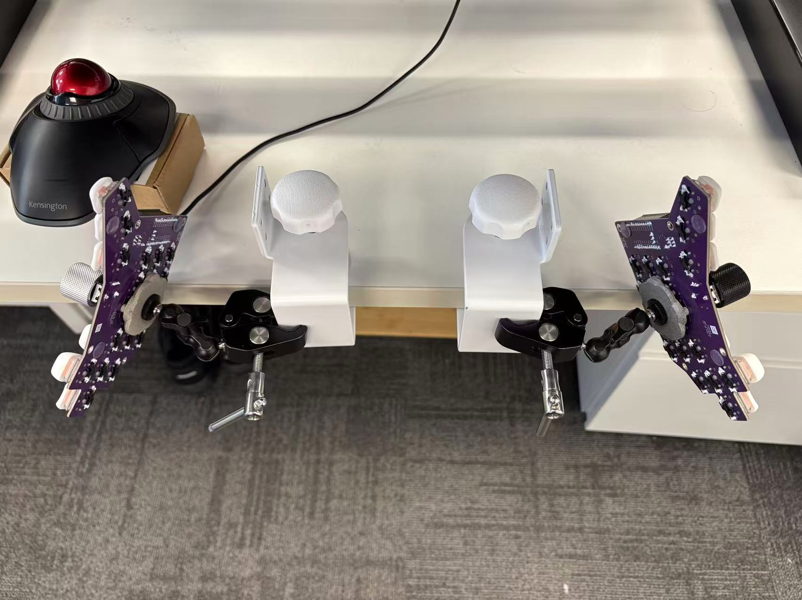

# C. Dux Keyboard

C. Dux front               |  C. Dux back
:-------------------------:|:-------------------------:
  |  

**C. Dux** is a 38-key split wireless keyboard inspired by
[**rae-dux**](https://github.com/andrewjrae/rae-dux) and
[**Architeuthis Dux**](https://github.com/tapioki/cephalopoda/tree/main/Architeuthis%20dux) (A. Dux).

## Features

- **Split Design**: 38-key, mainly 3x5 column-staggered layout, **3 thumb keys and 1 extra pinky key**
- **Choc v1 switch, optional hot-swap sockets**
- **Uses ZMK firmware**
- **Rotary encoder** placed near thumb, easy to reach
- **Diodless Reversible PCB**: Single PCB design that can be used for both left and right halves

Note: I did not consider designing a case as I use the keyboard with nacked PCB.
So it's better to use leadless PCB and solder. I find SAC305 solder (with 380-degree solder iron)
is a little harder to use compared to Tin-Lead 63/37 solder (with 280-degree solder iron),
but not too much. 

## Differences with rae-dux:

- **One extra key for little finger**
  - C. Dux [v1 uses 36-key](./pcb/v1.0/c-dux-front.png), but as a long time Vim user who uses Capslock as Esc, I
    missed the efficiency of pressing Esc with pinky. So I added the extra pinky key.
- **Supports EC11/EC12 rotary encoder**
  - I use the left encoder for left, right arrow keys, the right one for up and
    down. With layer switching, they are also used for page up/down, alt f/b (in
    shell), ctrl-tab/ctrl-shift-tab.
- **Using [ProMicro NRF52840](https://www.nologo.tech/product/otherboard/NRF52840.html) as controller**
  - I choose diodeless design to make things simple. With vanilla ProMicro's 18 GPIO pins, I
    can only build a 36-key keyboard.
  - Both [nice!nano](https://nicekeyboards.com/nice-nano/) and ProMicro NRF52840 provides 3 extra pins,
    which allows adding rotary encoder and one extra key. But the physical position for the 3 extra
    pins on those two controllers are not the same, so they are not fully compatible.
- **With mounting holes to for [Tenting Puck](https://splitkb.com/products/tenting-puck)**
  - Using only 3 holes, took the design from A. Dux
- **M4 holes for other mounting options**

The keyboard layout and PCB is generated using [Ergogen](https://github.com/ergogen/ergogen) v4.
Traces are added manually in KiCAD 8.
I learned how to use Ergogen form [FlatFootFox](https://flatfootfox.com/)'s
[Let's Design A Keyboard With Ergogen v4](https://flatfootfox.com/ergogen-introduction/) series articles,
highly recommended!

## Configurations

Refer to my [zmk-config](https://github.com/cyfdecyf/zmk-config) repo. I do
local build, github workflow is not tested.

Some combos are inspired by [Glove80 TailorKey](https://sites.google.com/view/keyboards/glove80_tailorkey).
(I own one [Moergo's Glove80](https://www.moergo.com/). It's a great keyboard. I
started using home-row mod with Glove80.)

## PCB files

Here's [v2.0 PCB gerbers file](./pcb/v2.0/c-dux-gerbers.zip). You can download
the file and place order from JLC.
I made a few fixes for problems found after I got the PCB from JLC, so it's not
exactly the same file I've used but should work without problems.

## Tips for using Ergogen with KiCAD

For non-key footprints (power/reset switches, etc.), my workflow is:

1. Generate the footprint in PCB with Ergogen at arbitrary position
2. Place the footprint in KiCAD with mouse
3. Use KiCAD ruler to find relative position to some key
4. Update the footprint position in Ergogen yaml file

## My own build

As I suffer from RSI, I choose the 20g pink Choc v1 switches (which is the lightest switches I know).
For keycaps, I find the 3D printed saddle variant of 
[KLP-Lame-Keycaps](https://github.com/braindefender/KLP-Lame-Keycaps) quite pleasant to use. The keycap
curve makes it easy to press the up & down rows, and helps a lot to position fingers on the home row.

PCBs are ordered from JLC. [Power](https://item.szlcsc.com/2774931.html) and
[reset](https://item.szlcsc.com/299976.html) switch are from LCSC.

### C. Dux v2

I got the idea of mouting keyboard on desk and let hands go twards the ground from
[Ben Vallack](https://www.youtube.com/@BenVallack)'s video
[The Perfect TENTING SOLUTION For Split Keyboards](https://www.youtube.com/watch?v=mT3TToFqqEU).
Check out Ben Vallack's channel if you are interested in ergonomic keyboards.

This is the most comfortable way for me to use a keyboard. **This position helps
a lot to relieve my RSI and I can work all day long without much pain in my forearm**.

### C. Dux v1

This is my first attempt to build a keyboard. The rotary encoder is difficult to reach
which is the biggest mistake I made.

The keycap used in this version is Chosfox's
[CFX](https://chosfox.com/products/chocfox-cfx-choc-keycaps) keycap.
(Search for "哈狐 Chosfox" on Taobao if you live in China.)
This keycap is not as smootch as Moergo's [MCC keycap](https://www.moergo.com/collections/mcc-keycaps),
but it's still quite good and is much cheaper. But as I like the curved keywell of Glove80,
I switched to KLP Lame keycaps later.

## Future plans

I'm quite comfortable with C. Dux v2 and I'm not planning to build an improved version soon.
But I do plan to build a third keyboard for backup.

Here are a few things that I'd like to change:

- Decrease thumb key spacing
  - v2 decrease thumb key spacing compared to v1, but it's still wider
    compared to Glove80's upper thumber cluster
- Change hotswap socket outer hole diameter to 1.72mm
  - v1 uses 1.7mm which is too tight, v2 uses 1.74mm which is a bit loose
- Move rotary encoder a little up to make it easier to reach for index finger
- Remove teardrop for all GND pads to make solding easier
  - Even thermal reliefs teardrop still makes it harder to solder
