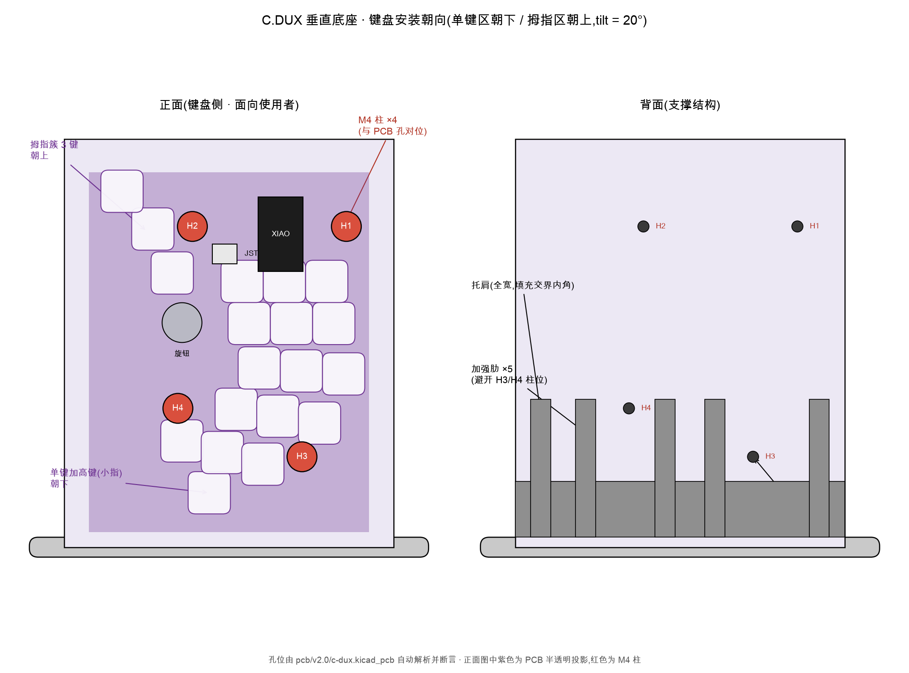

# C. Dux 垂直站立底座(build123d 版)

`stand.py` 是垂直站立底座的 Python/build123d 实现,与
[`case/scad/stand.scad`](../scad/stand.scad)(OpenSCAD 版)是同一设计,
参数同名同默认。区别:

- 同时导出 **STL + STEP** —— STEP 是嘉立创等代打服务的首选格式
  (精确 B-rep,非网格近似);
- B-rep 圆角:底座顶面周边 2 mm 圆角(OpenSCAD 做不到);
- **孔位/板框不手抄**:每次运行直接从 `pcb/v2.0/c-dux.kicad_pcb` 解析
  4 个 M4 孔坐标与板框尺寸,并与已验证的孔位表断言(±0.05 mm)。
  PCB 改版后若不一致,脚本拒绝出图——底座与板子不会悄悄失配。

站姿设计、装配、配重、打印姿态等说明见
[`case/scad/README.md`](../scad/README.md),两版共用,不再重复。

## 安装朝向(单键区朝下,拇指区朝上)

键盘装上底座的方向:**小指加高键(单键)朝下、三键拇指簇朝上**。
孔位映射据此翻转(`u = Y_max − Y_kicad`,`v = X_kicad − X_min`),因此
MCU/XIAO、JST、USB 出线位于背板中上部;加强肋的横向位置已避开翻转后
位于下部的 H3/H4 柱位(见 `stand.py` 的 `rib_x` 注释)。



## 环境(uv)

```sh
cd case/build123d
uv sync          # 创建 .venv,按 uv.lock 安装(build123d 0.11.1)
```

## 用法

```sh
uv run stand.py                          # 左半,tilt=20°,整体件
uv run stand.py --side right             # 右半
uv run stand.py --tilt 0                 # 完全垂直
uv run stand.py --part fit               # 平板验证件(背板+4柱)
uv run stand.py --attach tap             # 自攻底孔代替螺母沉孔
uv run stand.py --show                   # 只推送到查看器预览,不写文件
```

每个变体同时输出 `out/stand_<side>_tilt<n>_<part>.{stl,step}`,终端打印
包围盒、体积与估重(实心体积;FDM 有填充时实际更轻)。默认行为 =
**导出文件 + 顺带推送预览**:VS Code 里开着 OCP CAD Viewer 就会实时显示,
没开则打印一行提示、照常导出——文件产出不依赖查看器。

| 参数 | 默认 | 说明 |
|---|---|---|
| `--side` | `left` | 左/右半(整体镜像) |
| `--part` | `full` | `fit` = 平板验证件 |
| `--tilt` | 20 | 后仰角(度),0 = 完全垂直 |
| `--post-h` | 5 | 柱高 = PCB 与背板间隙 |
| `--attach` | `nut` | `nut` 螺母沉孔 / `tap` 自攻 |
| `--show` | — | 只推送到 OCP CAD Viewer 预览,不导出文件 |
| `--pcb` | `pcb/v2.0/c-dux.kicad_pcb` | 孔位与板框来源 |
| `--out` | `out/` | 输出目录 |

其余几何参数(背板/底座/筋条/胶垫/硬币槽尺寸)是 `stand.py` 顶部的
模块常量,名字与 `stand.scad` 一致。交互预览:VS Code 装
**OCP CAD Viewer** 插件,面板 Open Viewer 后运行本脚本即实时显示
(推送走 dev 依赖 `ocp-vscode`,每次推送自动取景);没开查看器时,
把 `out/*.step` 拖进任何 CAD 查看器也可以。

## 结构强化(垂直敲击工况)

垂直打字时,每次敲击都经背板传入"底座×背板"交界处,是反复冲击弯矩;
scad 版的"埋入 2.5 mm + 3 条小筋"在这个工况下偏弱。本版四处强化,
全部保持免支撑打印:

- **全宽托肩**(与背板等宽,深 18 / 高 25 mm):交界内角填成沿背板
  背面的 ~20° 缓坡,弯矩不再集中在一条内角线上——那是层间粘合最怕的
  位置;托肩不超出背板宽度,否则顶缘会在板外露出易脆的刀刃状尖脊;
- **5 条加强肋**(x = −56/−38/−6/14/56,厚 8 mm,沿背面升高 60 mm):
  抑制背板在肋间的弯曲,覆盖敲击最集中的下半区;横向位置避开安装朝向
  下位于底部的 H3/H4 柱位与背面螺丝穿孔;
- **背板埋入 2.5 → 4 mm**:交界抗剥离面积更大;
- **前侧内角 2.5 mm 圆角**:敲击把背板向前撬,受拉内角从刀刃变圆角。

代价:实心 +27 cm³(≈ +27 g PA12)。想加密肋条改顶部常量 `rib_x`
即可,每条 ≈ +5 g;交界已由托肩连续加固,条数边际收益递减。

## 键盘离台高度与底座尺寸

键盘最低点 = PCB 板底缘(实测 19 颗键的键帽都不超出板下缘,最低的
单键加高键帽下缘还在板缘上方 ~3 mm)。板底缘高度受两个约束:**容纳**
(全倾角范围内不碰底座顶面,最紧的是 tilt=0 全垂直档)与**尽量低**。
当前取值 `base_t 8`、`bottom_ext 6.5`、`EMBED 4`:

- tilt=0:板底缘距底座顶面 2.5 mm(约束绑定工况);
- tilt=20:板底缘距台面 13.9 mm(较初版降 3.4 mm),距底座顶面 5.9 mm;
- 键帽 / XIAO / USB 出线距底座顶面 ≥6 mm。

若接受 tilt ≥ 12° 的使用范围,`bottom_ext` 可再降到 5,键盘再降
~1.5 mm。底座同时加深加宽:`base_front 30 → 40`(支撑多边形向手位
扩展)、`base_side 18 → 24`(横向 160.5 mm),抑制敲击晃动;胶垫
位置随外轮廓自动外移。

## 嘉立创代打

- **上传 `.step`**(优先)或 `.stl`,都在 `out/` 里。
- **工艺建议**:首版验证件怎么便宜怎么来(FDM PETG/PLA);长期使用和
  将来的 v2 可调机构建议 PA12(MJF/SLS)——免支撑、强度好、耐蠕变,
  摩擦特性也适合铰链。
- **公差基准**(工艺未定,按两种工艺都稳妥取值):活动/配合面间隙
  ≥ 0.4 mm,壁厚 ≥ 1.6 mm,M4 螺母沉孔 7.4 mm 跨面 / 3.4 mm 深(已含
  余量)。确定工艺后可微调:FDM 再放宽约 0.1 mm,PA12 可收紧
  0.05–0.1 mm。
- **先打验证件**:`--part fit` 是平板 + 4 柱,几分钟打完,拿 PCB 和
  4 颗 M4 螺钉实配孔位与柱高,再下整体件的订单。

## 首版验证清单

1. 4 个 M4 孔与 PCB 对位(fit 件 + 螺钉穿板);
2. `--post-h` 间隙:背面轴座/焊点/电池座不顶背板(背面若有 ~6 mm 高件
   则 `--post-h 7`);
3. tilt=20° 站姿:桌面实测后仰稳定性;不够就加硬币配重(底座后侧
   2 条 27 mm 硬币槽,每槽约 6 枚 ≈ 70 g)或调大 `base_rear`;
4. 交界刚性:装板后按压背板顶部前后晃,托肩/肋区域应无弹性异响。

## v2 路线:物理可调倾角

首版验证通过后,把"背板 + 柱"从底座独立成两个零件,加**摩擦铰链**:
M4/M5 枢轴螺钉 + 尼龙自锁螺母 + 两片大面积摩擦面,与现有 M4 紧固件
同 BOM,结构最简单可靠。备选:棘位齿弧(档位明确,但复杂度与公差
要求更高)。届时活动面间隙按选定工艺的公差重校。

## 坐标换算

KiCad 的 Y 轴朝下,垂直站姿把板子旋转 90° 站起来。换算不再用手工常数,
每次从 PCB 文件推导(`stand.py` 的 `parse_pcb`):

- `u`(横向,自"顶行"长边)= `Y_kicad − Y_min`
- `v`(离地高度,自控制器内侧边)= `X_max − X_kicad`

`Y_min` / `X_max` 取自 Edge.Cuts **直边**端点(圆角弧的中点会外凸约
0.4 mm,不参与取框——与 `case/scad/README.md` 人工核对表的坐标系
一致)。孔位换算结果与人工核对表逐项断言。
