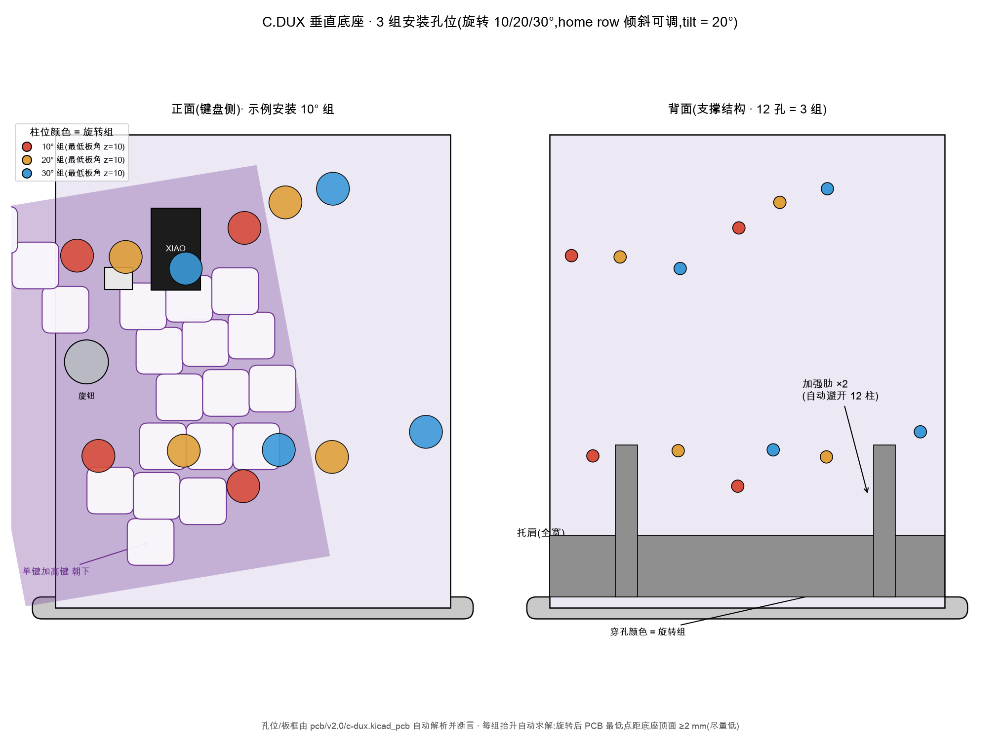

# C. Dux 垂直站立底座

`stand.py` 是垂直站立底座的 Python/build123d 实现。要点:

- 默认导出 **STL**(切片用),`--step` 加导 STEP —— STEP 是嘉立创等
  代打服务的首选格式
  (精确 B-rep,非网格近似);
- B-rep 圆角:底座顶面周边 2 mm 圆角(OpenSCAD 做不到);
- **两件式**:底座与立板(背板+柱+靴座)拆成两个零件,榫键 + 2×M4 螺丝
  连接——底座只打印一次(完全对称,不分左右),试不同后仰角只换立板件
  (`--tilt`,首版只出 20°);
- **孔位/板框不手抄**:每次运行直接从 `pcb/v2.0/c-dux.kicad_pcb` 解析
  4 个 M4 孔坐标与板框尺寸,并与已验证的孔位表断言(±0.05 mm)。
  PCB 改版后若不一致,脚本拒绝出图——底座与板子不会悄悄失配。

## 设计:垂直(dodo 式)站姿

面向**站立使用**:手臂自然垂下,手掌侧向,手指沿列方向卷曲按键。因此:

- **列竖直**:小指加高键(单键)朝下、三键拇指簇朝上(与 Dodo 等
  垂直键盘一致,孔位映射见下节);
- 后仰角 `tilt`(默认 20°;照片实测站立舒适姿约 20–30°,换角度只
  重打立板,见"两件式结构"一节);
- 旋钮(encoder)随拇指簇位于站姿上部、正对使用者,正好当音量键用;
- MCU/XIAO、JST、USB 出线都在背板中上部:USB 线从侧面引出,不碰
  背板和底座;
- 裸板使用:PCB 由 4 根柱子架在背板前,`post_h`(默认 5 mm)保证
  背面的轴座/焊点/连接件不碰到背板;键帽朝向使用者一侧;
- 抗后倾不靠配重:底座向后仰侧延伸(`base_rear` 100 mm)拉长力臂
  (见"键盘离台高度与底座尺寸"一节),默认无硬币槽等配重件。

## 安装朝向(单键区朝下,拇指区朝上)

键盘装上底座的方向:**小指加高键(单键)朝下、三键拇指簇朝上**。
孔位映射据此翻转(`u = Y_max − Y_kicad`,`v = X_kicad − X_min`),因此
MCU/XIAO、JST、USB 出线位于背板中上部。



## 多组安装孔位(home row 倾斜可调)

背板上重复了 **3 组 M4 柱位**(平面内旋转 10/20/30°):每组是同一 4 孔
图案绕图案质心旋转一个角度,换组重装螺丝,键盘的平面内旋转角就变,
home row 的倾斜度随之调整——手腕前倾越多,换越大角度的组。

- 每组的位置由求解器自动排布:横向错开保证任意两柱间距 ≥13 mm,并逐组
  抬升,保证 **PCB 最低点(旋转后的板角)距底座顶面 ≥2 mm**——在此
  约束下每组都压到允许的最低位置(`--set-angles 10,20,30` 可改角度与
  组数,负值 = 反方向倾斜);
- **5° 步进几何上不可行**:12 mm 的柱在 5° 间隔下同孔柱心距仅 4-5 mm,
  相邻组的柱会融成一体;10° 步进 + 每组横向错位是柱径允许的最小方案;
- 代价:下部背板柱位密集(12 柱),加强肋自动避让后只放得下 2 根,
  交界刚度主要由靴座、托肩楔与榫键+螺丝承担。

## 环境(uv)

```sh
cd case/build123d
uv sync          # 创建 .venv,按 uv.lock 安装(build123d 0.11.1)
```

## 用法

```sh
uv run stand.py --part base                # 共享底座(打印一次,不分左右)
uv run stand.py --part upright             # 左立板,20° 后仰
uv run stand.py --side right --part upright
uv run stand.py --part upright --tilt 10,15,20,25,30   # 一批角度的立板
uv run stand.py --part full                # 装配预览(两件布尔并,左半)
uv run stand.py --part joint               # 配合试块(先打这个!)
uv run stand.py --part fit                 # 平板验证件(旧,柱位实配用)
uv run stand.py --set-angles 10,20,30      # 自定义平面内旋转组
```

输出到 `out/`:`stand_base.*`(底座,不分左右)、
`stand_<side>_upright_t<角度>.*`(立板)、`stand_<side>_full_t<角度>.*`
(装配预览)、`joint_coupons.*`(试块)。默认只导出 STL(切片用),加
`--step` 同时导出 STEP——代打服务的首选格式(精确 B-rep,非网格近似)。
终端打印包围盒、体积与估重(实心体积;FDM 有填充时实际更轻)。默认行为 =
**导出文件 + 顺带推送预览**:VS Code 里开着 OCP CAD Viewer 就会实时显示,
没开则打印一行提示、照常导出——文件产出不依赖查看器。

| 参数 | 默认 | 说明 |
|---|---|---|
| `--part` | `full` | `base` 共享底座 / `upright` 立板 / `full` 装配预览 / `joint` 配合试块 / `fit` 平板验证件 |
| `--tilt` | `20` | 立板/装配预览的后仰角(度),逗号分隔可批量出图 |
| `--side` | `left` | 左/右半(底座对称,忽略此参数) |
| `--set-angles` | `10,20,30` | 各旋转组的平面内旋转角(度) |
| `--post-h` | 5 | 柱高 = PCB 与背板间隙 |
| `--attach` | `nut` | `nut` 螺母沉孔 / `tap` 自攻(仅 PCB 柱位) |
| `--show` | — | 只推送到 OCP CAD Viewer 预览,不导出文件 |
| `--pcb` | `pcb/v2.0/c-dux.kicad_pcb` | 孔位与板框来源 |
| `--out` | `out/` | 输出目录 |

其余几何参数(背板/底座/筋条/胶垫/连接件尺寸)是 `stand.py` 顶部的
模块常量,改源码即可调整。交互预览:VS Code 装
**OCP CAD Viewer** 插件,面板 Open Viewer 后运行本脚本即实时显示
(推送走 dev 依赖 `ocp-vscode`,每次推送自动取景);没开查看器时,
把 `out/*.step` 拖进任何 CAD 查看器也可以。

## 两件式结构:共享底座 + 按角度换装立板

底座(144.5 × 140 × 8 mm,与立板背板 144 mm 齐平——不再比立板宽,
横向省料;前后进深不变,保抗后倾力臂)与立板(背板 + 12 柱 + 靴座)
拆成两个零件,目的是**底座只打一次**,试不同后仰角只重打立板:

- 接合面是水平座面(z = 8 mm),所有连接特征都用世界坐标定义、与倾角
  无关——同一底座配任意角度的立板,而且完全对称、不分左右;
- **连接 = 2 榫键 + 2×M4**:底座顶面两根 30 × 8 × 3.2 mm 榫键(x = ±12,
  顶缘 0.5 mm 倒角)抗剪、定位;立板靴座底开 0.4 mm 间隙的榫槽;
  2 颗 M4×12 内六角**从底座底面的沉头孔(x = ±58)向上拧**,穿过底座
  与靴座,拧进靴座顶部的螺母座(7.4 mm 跨面 × 3.4 mm 深,开口带
  6.9 mm 收口唇,螺母压入后常驻立板,不随拆卸丢失)。为什么从下面拧:
  立板后仰后背板悬在靴座顶上方 ~48 mm,从上往下拧螺丝刀没有空间;
  底面完全敞开,而且螺丝长一点也不占地方;
- 承载分工:敲击压力由座面大平面承担,水平剪力由榫键承担,前撬与夹紧
  由 2 颗 M4 承担。键顶 11.2 / 槽顶 11.6 mm,立板承压全落在座面上,
  不搁在键上;
- **换角度 = 拧 2 颗螺丝**:松螺丝 → 取下立板 → 换角度件 → 紧回
  (螺母常驻靴座;每块立板可自配一对,换装时不倒腾螺母)。装配姿势:
  螺母先压入靴座、立板落到榫键上,然后把组装体侧翻或垫高,从底面
  拧 2 颗螺丝——不能整体翻平,立板会顶桌面;
- BOM 每侧新增:**2 × M4×12 内六角螺钉**(其余 M4 紧固件不变;螺钉
  尖端会高出靴座面 ~2 mm,处在背板后方的敞空处,无碍);
- 公差按下方"嘉立创代打"的基准取 0.4 mm;先打 `--part joint` 配合试块
  (两小块,几分钟),实测榫键推入手感与螺母收口唇,再下整件订单。

## 结构强化(垂直敲击工况)

垂直打字时,每次敲击都经背板传入"底座×立板"交界处,是反复冲击弯矩。
拆成两件后交界强度不再靠埋入,以下强化全部保持免支撑打印:

- **靴座**(与背板等宽,深 22 / 高 6 mm):立板底部的"脚",在座面上
  满接触承压,交界不再是一条内角线;榫槽开在靴座底;
- **托肩楔**(深 18 / 高 10 mm):靴座之上沿背面的缓坡,继续填交界
  内角;高度压到 10 mm,让 2 颗 M4 的沉头完整落在靴座平台上;
- **加强肋**(厚 8 mm,沿背面升高 60 mm,x 位置由柱位布局自动
  避让求解,同时避让榫键与螺钉):抑制背板在肋间的弯曲;当前布局
  放入 2 根;
- **2×M4 螺栓连接**:敲击把背板向前撬的受拉侧现在由螺栓拉住,而且
  可重新紧固——蠕变松弛后拧紧一圈即可,这是整体件做不到的可维护性。

原整体件的"埋入 4 mm"与"前侧内角 2.5 mm 圆角"随拆分取消:前侧受拉
内角属于装配体,单件上不存在;靴座提供的交界材料远多于埋入。

## 键盘离台高度与底座尺寸

键盘的最低点 = 旋转后板角的最低角点(实测 19 颗键的键帽都不超出板边,
键帽不会比板角更低)。高度约束只有一条:**旋转后 PCB 最低点距底座顶面
≥2 mm**——求解器对每组旋转角单独求最小抬升,在保有余量的前提下把键盘
压到最低;底座顶面高度由 `base_t 8`、板底延伸由 `bottom_ext 6.5` 控制,
板底直接落在座面(取消埋入,键盘整体比整体件高约 4 mm),交界强度交给
靴座+榫键+螺丝。底座各向:`base_front 40`(向手位扩展)、
`base_side 16`(横向 144.5 mm,与立板齐平不再外扩,横向支撑靠胶垫
跨距)、`base_rear 100`(键盘后仰侧加长,进深 140 mm,拉长抗后倾
力臂),抑制敲击晃动;胶垫位置随外轮廓自动外移。

## 打印建议

- **按建模姿态打印、无需支撑**:底座底面朝下——底面沉头孔与胶垫凹槽
  都是浅凹,桥接无压力;立板座面朝下——柱子、柱顶螺母沉孔、靴座
  螺母座开口都朝上敞开,靴座底榫槽开口朝下,槽顶 11.6 mm 属小桥接,
  普通切片器没问题;
- 0.2 mm 层高、3–4 层壁、10–15% gyroid 填充;PLA/PETG 均可(PETG 更
  耐蠕变),长期使用建议 PA12(见下节"嘉立创代打");
- 两件拆开后各自都放得进常见 220×220 成型尺寸打印机:底座
  144.5 × 140 × 8 mm,立板包围盒以脚本运行时的终端输出为准。

## 装配

1. **立板装底座**:2 × M4×12 从底座底面沉头孔向上拧入靴座螺母座,
   换角度 = 拧 2 颗螺丝(流程与姿势见"两件式结构"一节);
2. **固定 PCB**:4 × M4 螺钉(推荐 M4×10 内六角/圆头)+ M4 螺母——
   螺母放入柱顶六角沉孔 → PCB 从前方套入 4 根柱 → 拧紧,螺母被拉紧
   在沉孔里;备选 `--attach tap` 自攻方案(柱内留 M4 底孔,直接自攻,
   免螺母);
3. **防滑**:底座底面有 6 个直径 `pad_d`(20 mm)、深 0.8 mm 的定位
   凹槽,贴自粘橡胶垫即可,不易移位、不翘边。

## 嘉立创代打

- **上传 `.step`**(优先)或 `.stl`(`--step` 导出),都在 `out/` 里。
- **工艺建议**:首版验证件怎么便宜怎么来(FDM PETG/PLA);长期使用和
  将来的 v2 可调机构建议 PA12(MJF/SLS)——免支撑、强度好、耐蠕变,
  摩擦特性也适合铰链。
- **公差基准**(工艺未定,按两种工艺都稳妥取值):活动/配合面间隙
  ≥ 0.4 mm,壁厚 ≥ 1.6 mm,M4 螺母沉孔 7.4 mm 跨面 / 3.4 mm 深(已含
  余量)。确定工艺后可微调:FDM 再放宽约 0.1 mm,PA12 可收紧
  0.05–0.1 mm。
- **先打验证件**:`--part joint` 是两小块配合试块(榫键/榫槽、底面
  沉头、靴座螺母座),`--part fit` 是平板 + 全部柱位(3 组 × 4),都是
  几分钟打完:先用试块实测 0.4 mm 间隙是否顺手,再拿 PCB 和 M4 螺钉
  实配柱位与柱高,最后才下底座/立板的订单。

## 首版验证清单

1. 选定旋转组的 4 根 M4 柱与 PCB 对位(fit 件含全部 3 组柱位,按你用的
   那组试装螺钉);
2. `--post-h` 间隙:背面轴座/焊点/电池座不顶背板(背面若有 ~6 mm 高件
   则 `--post-h 7`);
3. 连接试块:`--part joint` 实测榫键推入 0.4 mm 间隙的手感、螺母压入
   靴座收口唇且不回落、M4×12 从底面拧入后螺纹穿满螺母(尖端高出靴座
   面 ~2 mm 属正常,处在敞空处);
4. tilt=20° 站姿:桌面实测后仰稳定性。默认**无配重**;实测不够再补偿,
   两个旋钮任选:加厚 `base_t`(8→12,+~76 g 最低位质量,键盘升高
   4 mm)、或调大 `base_rear`(重新出图);
5. 交界刚性:立板装上底座、从底面拧紧 2 颗 M4×12 后,按压背板顶部
   前后晃,靴座/托肩/肋区域应无弹性异响;
6. 换装流程:松 2 颗螺丝换上另一角度立板(如 `--tilt 30`),确认榫键
   重复定位一致、无旷量。

## v2 路线:两件式已落地,单件内可调仍是后续

"背板 + 柱"独立于底座的两件式结构**已完成**(榫键 + 2×M4 螺丝,见
"两件式结构"一节):试不同倾角 = 打对应角度的立板件(`--tilt`),底座
通用。在此基础上的下一步才是**单件内连续可调**的摩擦铰链:M4/M5 枢轴
螺钉 + 尼龙自锁螺母 + 两片大面积摩擦面,与现有 M4 紧固件同 BOM,结构
最简单可靠;备选:棘位齿弧(档位明确,但复杂度与公差要求更高)。届时
活动面间隙按选定工艺的公差重校。

## 坐标换算

KiCad 的 Y 轴朝下,垂直站姿把板子旋转 90° 站起来;按"安装朝向"一节
的方向,两轴相对 KiCad 视图均翻转。换算不用手工常数,每次从 PCB 文件
推导(`stand.py` 的 `parse_pcb`):

- `u`(横向)= `Y_max − Y_kicad`
- `v`(离地高度,自小指加高键一侧板边)= `X_kicad − X_min`

`X_min` / `Y_max` 取自 Edge.Cuts **直边**端点(圆角弧的中点会外凸约
0.4 mm,不参与取框)。孔位换算结果与最后一次人工核对的孔位表
(`stand.py` 顶部的 `HOLES_EXPECTED`)逐项断言(±0.05 mm)。
